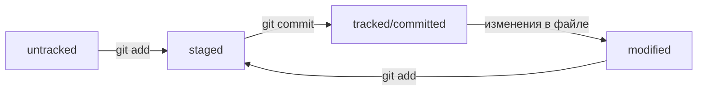

# git-hints

## Небольшой гит-репозиторий для самостоятельной работы

`git clone https://github.com/PraktikumJava/git-hints.git`

# Хеш — идентификатор коммита

---

Хеширование (от англ. hash, «рубить», «крошить», «мешанина») — это способ преобразовать набор данных и получить их «отпечаток» (англ. fingerprint).
Информация о коммите — это набор данных: когда был сделан коммит, содержимое файлов в репозитории на момент коммита и ссылка на предыдущий, или родительский (англ. parent), коммит. Git хеширует (преобразует) эту информацию с помощью алгоритма SHA-1 (от англ. Secure Hash Algorithm — «безопасный алгоритм хеширования») и получает для каждого коммита свой уникальный хеш — результат хеширования.
В то время, как результат работы метода hashCode() — это целое число, результат хеширования в Git — символьная строка. Она относительно коротка (40 символов в случае SHA-1) и состоит из цифр 0—9 и латинских букв A—F(неважно, заглавных или строчных). 
Хеш обладает следующими важными свойствами:
* если хеш получить дважды для одного и того же набора входных данных, то результат будет гарантированно одинаковый;
* если хоть что-то в исходных данных поменяется (хотя бы один символ), то хеш тоже изменится (причём сильно).

# Исследуем лог
После вызова `git log` появляется список коммитов с их описанием.
## Вот из каких элементов состоит описание:
* Строка из цифр и латинских букв после слова commit — это уже знакомый вам хеш коммита.
* Author — имя автора и его электронная почта.
* Date — дата и время создания коммита.
* Сообщение к коммиту.

### Сокращённый лог вызывают командой `git log` с флагом `--oneline` (англ. «одной строкой»). При этом в терминале появятся только первые несколько символов хеша каждого коммита и комментарии к ним.

# `HEAD` — всему голова
При вызове команды `git log` вы также могли заметить надпись (HEAD -> master) после хеша одного из коммитов.

Файл `HEAD` (англ. «голова», «головной») — один из служебных файлов папки `.git`. Он указывает на коммит, который сделан последним (то есть на самый новый).
Убедитесь в этом с помощью терминала. Перейдите в папку `.git` командой `cd`. Посмотрите содержимое файла `HEAD` командой `cat`.
Внутри `HEAD` — ссылка на служебный файл: `refs/heads/master` (или `refs/heads/main` в зависимости от названия ветки). Если заглянуть в этот файл, можно увидеть хеш последнего коммита.

Когда вы делаете коммит, Git обновляет `refs/heads/master` — записывает в него хеш последнего коммита. Получается, что `HEAD` тоже обновляется, так как ссылается на `refs/heads/master`.
При работе с Git указатель `HEAD` используется довольно часто. Мы уже упоминали, что многие команды Git принимают в качестве параметра хеш коммита. Если нужно передать последний коммит, то вместо его хеша можно просто написать слово `HEAD` — Git поймёт, что вы имели в виду последний коммит.

# Статусы `untracked/tracked`, `staged` и `modified`
  Одна из ключевых задач Git — отслеживать изменения файлов в репозитории. Для этого каждый файл помечается каким-либо статусом. Рассмотрим основные.
* `untracked` (англ. «неотслеживаемый»)
  Новые файлы в Git-репозитории помечаются как `untracked`, то есть неотслеживаемые. Git «видит», что такой файл существует, но не следит за изменениями в нём. У untracked-файла нет предыдущих версий, зафиксированных в коммитах или через команду `git add`.
`staged` (англ. «подготовленный»)
После выполнения команды `git add` файл попадает в `staging area` (от англ. stage — «сцена», «этап [процесса]» и area — «область»), то есть в список файлов, которые войдут в коммит. В этот момент файл находится в состоянии `staged`.
`tracked` (англ. «отслеживаемый»)
Состояние `tracked` — это противоположность `untracked`. Оно довольно широкое по смыслу: в него попадают файлы, которые уже были зафиксированы с помощью `git commit`, а также файлы, которые были добавлены в staging area командой `git add`. То есть все файлы, в которых Git так или иначе отслеживает изменения.
`modified` (англ. «изменённый»)
Состояние `modified` значит, что Git сравнил содержимое файла с последней сохранённой версией и нашёл отличия. Например, файл был закоммичен и после этого изменён.

## Схема жизненного цикла

